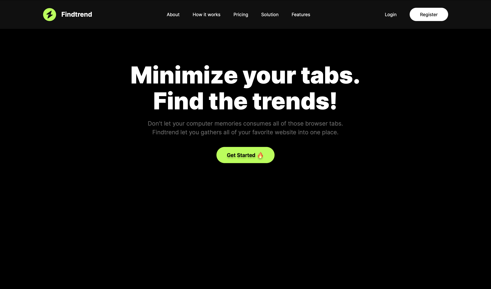

# Findtrend

### What I Learned

- How to do conditional CSS with data attributes (and 2 lines of JavaScript)
- How to use grid auto columns/rows
- How to use pseudo elements instead of custom list-type property
- How to recreate a Figma design in website code
- How to create a three part navbar in two ways

[Figma design](<https://www.figma.com/file/AzKOk465IeVY5Kjx7GgVKc/Findtrend-Webflow-(Free-Code)-(Community)>)
